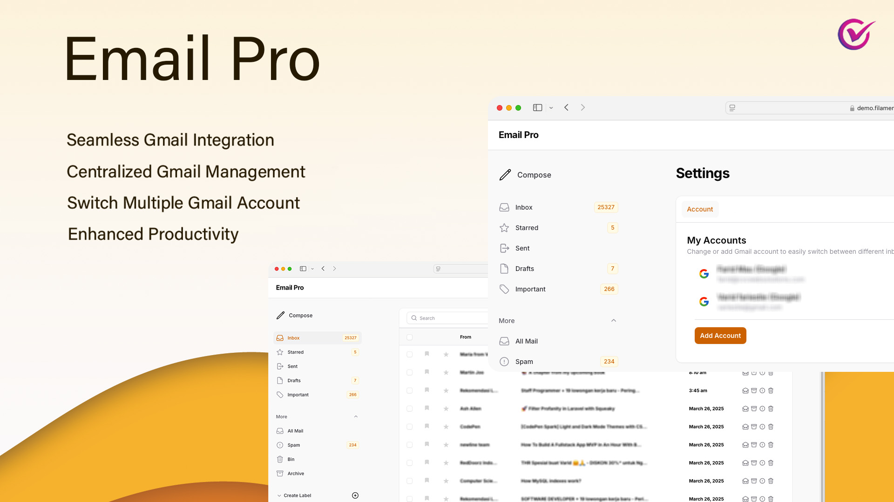
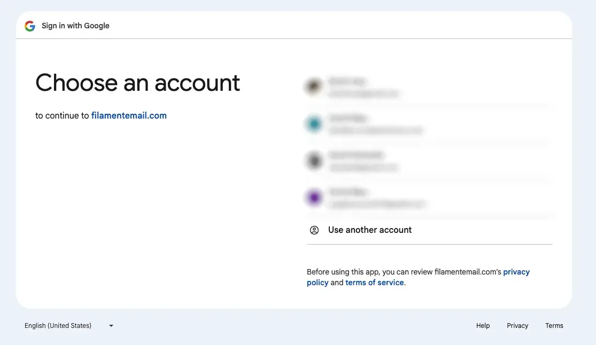
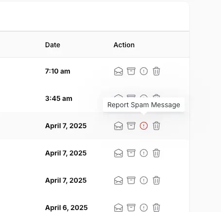
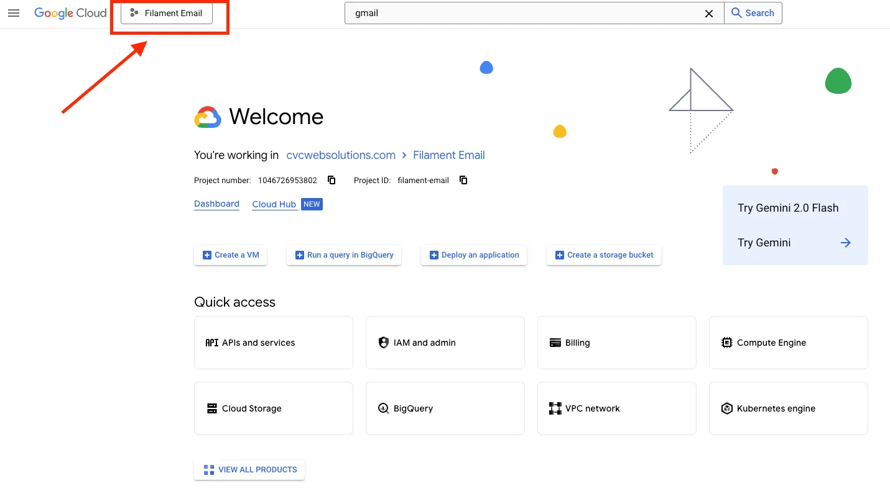
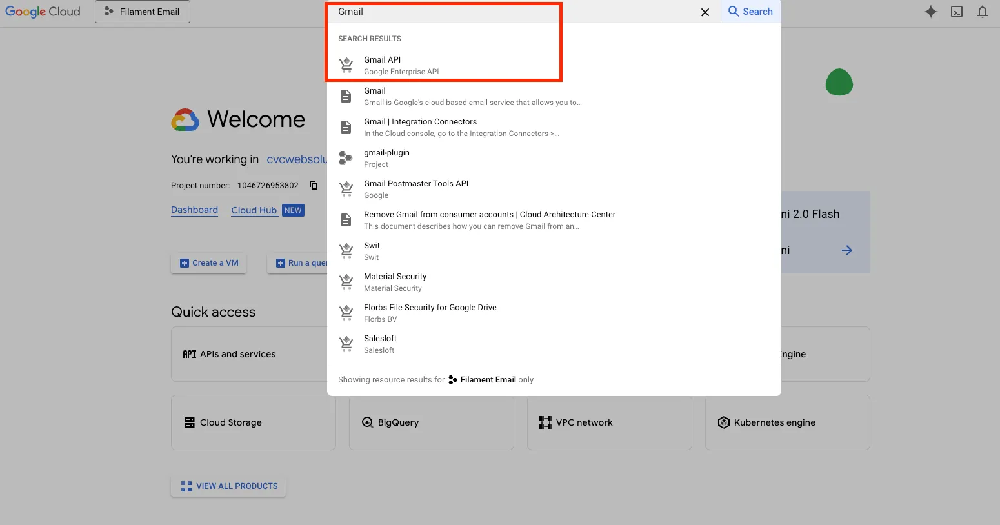
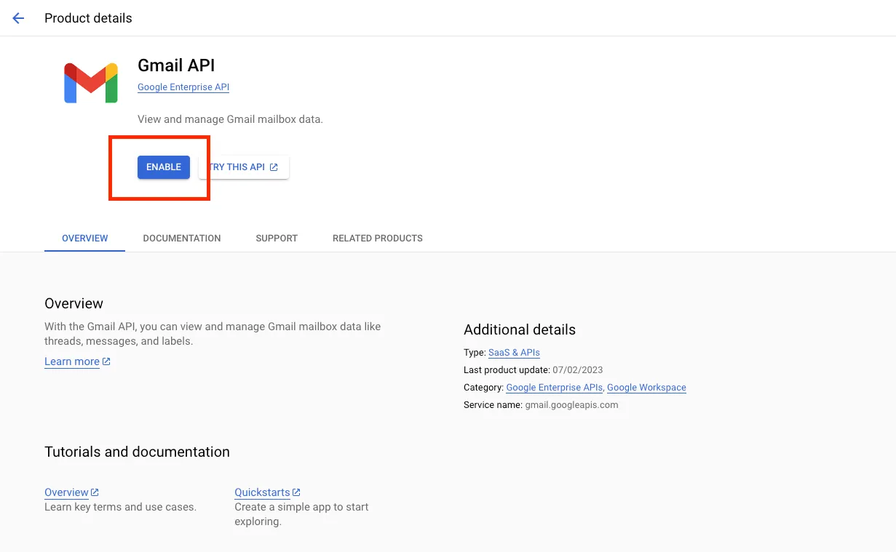
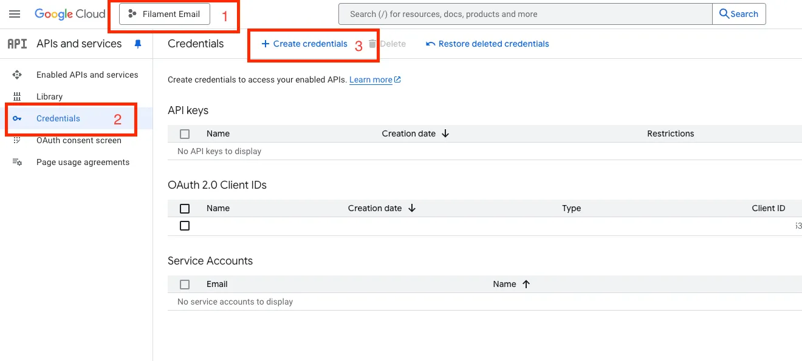
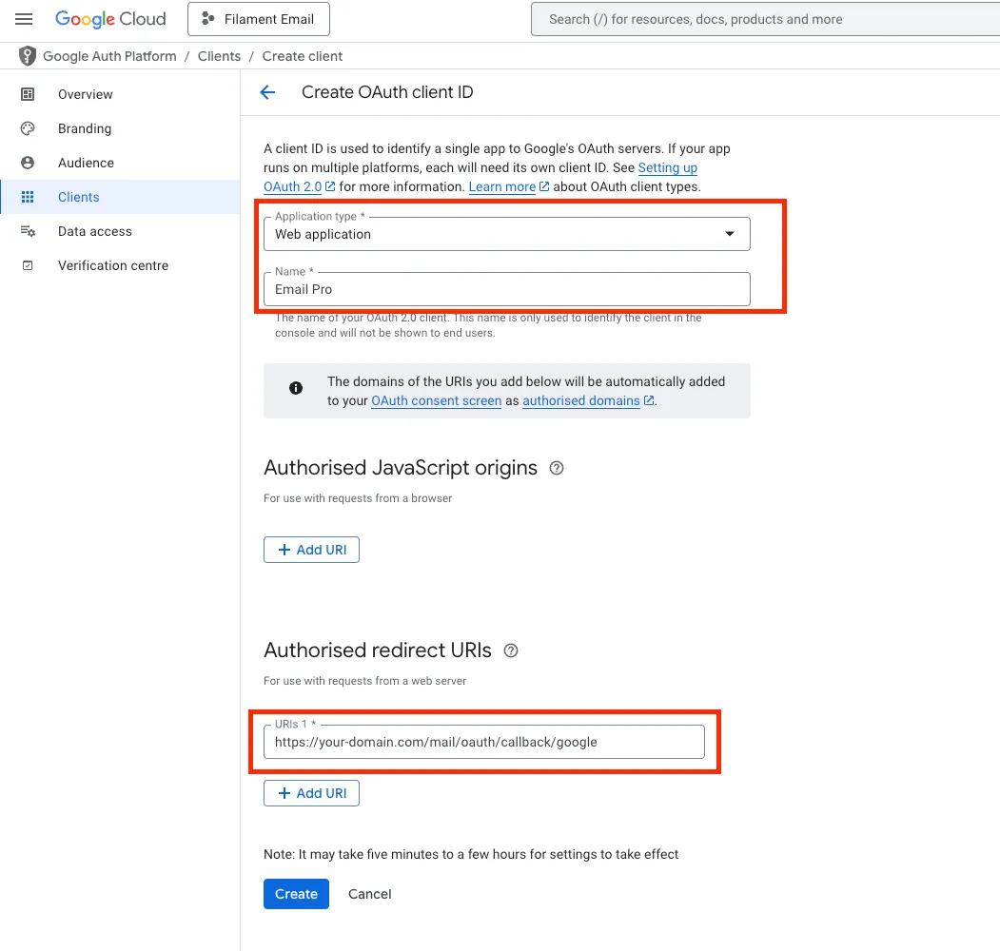
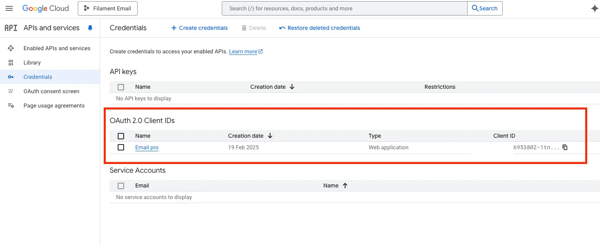
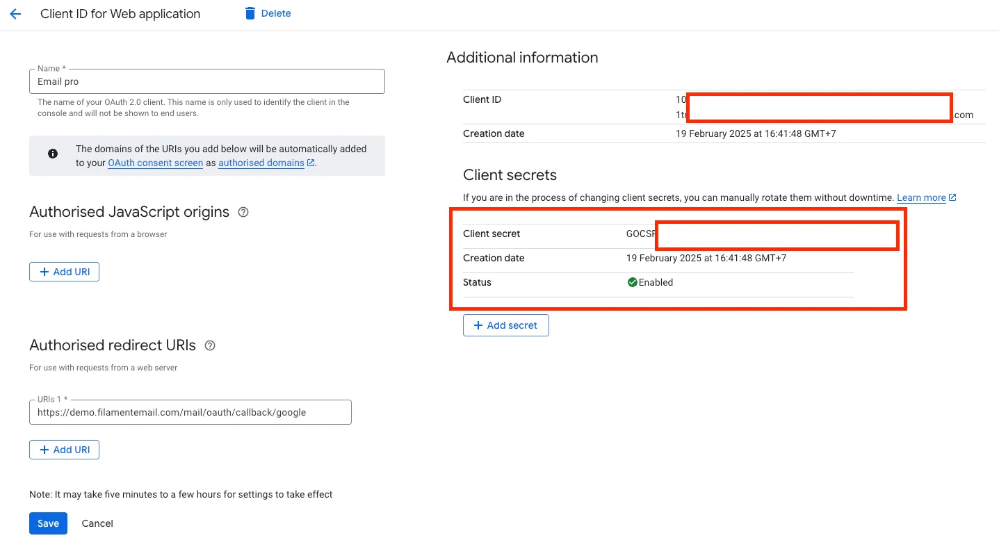

# ✉️ Email Pro

EmailPro is a powerful FilamentPHP plugin designed to seamlessly synchronize and manage emails within your application.

With EmailPro, you can effortlessly integrate Gmail, view and organize emails, and perform essential email actions—all within the FilamentPHP admin panel.

## 📑 Table of Contents
- [✉️ Email Pro](#️-email-pro)
- [📑 Table of Contents](#-table-of-contents)
- [Introduction](#introduction)
      - [Gmail Integration – Built for Developers Who Mean Business](#gmail-integration--built-for-developers-who-mean-business)
    - [Centralized Management \& Built-In Email Hub](#centralized-management--built-in-email-hub)
    - [Essential Gmail Integration](#essential-gmail-integration)
- [Installations](#installations)
    - [Requirements](#requirements)
    - [Activating Your License](#activating-your-license)
    - [Configure Google API in Laravel](#configure-google-api-in-laravel)
    - [Publishing Configuration and Migrations](#publishing-configuration-and-migrations)
    - [Usage](#usage)
      - [Updating User Model](#updating-user-model)
      - [Registering the Plugin](#registering-the-plugin)
      - [Setting Up Queues](#setting-up-queues)
- [Google credentials](#google-credentials)
  - [Step 1: Go to Google Cloud Console](#step-1-go-to-google-cloud-console)
  - [Step 2: Select or Create a Project](#step-2-select-or-create-a-project)
  - [Step 3: Enable APIs and Enable Gmail API Services](#step-3-enable-apis-and-enable-gmail-api-services)
  - [Step 4: Create OAuth 2.0 Credentials](#step-4-create-oauth-20-credentials)
  - [Client ID \& Client secret](#client-id--client-secret)
- [Features \& Updates](#features--updates)
- [Community \& Support](#community--support)
- [Visual Demonstrations](#visual-demonstrations)


## Introduction
##### Gmail Integration – Built for Developers Who Mean Business
Effortlessly connect your Gmail account to your FilamentPHP app and unlock seamless, in-app email management that just works—no context switching, no hassle



#### Centralized Management & Built-In Email Hub
Turn your admin panel into a communication powerhouse with native Gmail integration that feels tailor-made for your team. View, organize, and search emails directly within the FilamentPHP admin panel.


#### Essential Gmail Integration
Transform your FilamentPHP app into a full-featured Gmail client—sync, manage, and take action on emails without leaving your dashboard. Perform key email actions like reading, archiving, deleting, and labeling without leaving your panel.



## Installations
#### Requirements
- Filament v3
- Laravel 11+
- PHP 8.2+
- A Google Cloud Project with Gmail API enabled
#### Activating Your License
> 💡 Email Pro leverages **AnyStack** for seamless payment processing, licensing, and distribution. [You can buy it here](https://checkout.anystack.sh/email-pro)

Add the following repository to your **composer.json** file:
```json
"repositories": [
    {
        "type": "composer",
        "url": "https://email-pro.composer.sh"
    }
],
```
Then install the package:
```bash
composer require cvcwebsolutions/email-pro
```

You will be prompted to provide your username and password:
```bash
Username: [licensee-email]
Password: [license-key]
```
#### Configure Google API in Laravel
Configure your Google OAuth credentials in .env:
```bash
GOOGLE_CLIENT_ID=YOUR_GOOGLE_CLIENT_ID
GOOGLE_CLIENT_SECRET=YOUR_GOOGLE_CLIENT_SECRET
GOOGLE_REDIRECT_URI="https://your_domain.com/mail/oauth/callback/google"
```
#### Add Google credentials in `config/services.php`:
```php
'google' => [
    'client_id' => env('GOOGLE_CLIENT_ID'),
    'client_secret' => env('GOOGLE_CLIENT_SECRET'),
    'redirect' => env('GOOGLE_REDIRECT_URI'),
],
```
#### Publishing Configuration and Migrations
Publish the config file:
```bash
php artisan vendor:publish --tag="email-pro-config"
```
Publish and run migrations:
```bash
php artisan vendor:publish --tag="email-pro-migrations"
php artisan migrate
```
Optionally, publish the views:
```bash
php artisan vendor:publish --tag="email-pro-views"
```
#### Usage
##### Updating User Model
Add the <span style="color: orange;">*HasEmailProviders*</span> trait to the User model:
```php
use Cvcwebsolutions\EmailPro\Support\Traits\HasEmailProviders;
use Illuminate\Database\Eloquent\Model;

YourUserModel extends Model {
    use HasEmailProviders;
}
```
##### Registering the Plugin
To use this package, register the plugin in your Filament Panel Provider class:
```php
use Cvcwebsolutions\EmailPro\EmailProPlugin;

// ...
->plugins([
    EmailProPlugin::make()
]);
```
##### Setting Up Queues
> 💡 To ensure smooth and efficient email operations, we highly recommend setting up a queue system. This helps handle API requests asynchronously, improving performance and user experience!
```bash
QUEUE_CONNECTION=database
or
QUEUE_CONNECTION=redis
```

Start the queue worker for development or testing environments using the following command:

```bash
php artisan queue:work
or
php artisan queue:listen
```


It will generate a navigation menu item based on <span style="color: orange;">*config('email-pro.filament.menu_item')*</span>

Clicking the menu will lead to the settings page:


## Google credentials
How to Enable Gmail API and Create Google API Credentials
##### Step 1: Go to Google Cloud Console
Open your browser and go to: https://console.cloud.google.com/. (I’m assuming that you’ve already created a Google account and are signed in. )
##### Step 2: Select or Create a Project
- Click the project dropdown in the top-left corner (next to the Google Cloud logo).
  
- Choose an existing project, or click “**New Project**” to create a new one.
- Give it a name and click **Create**.
- After it’s created, make sure the project is **selected**.
  
##### Step 3: Enable APIs and Enable Gmail API Services
- In the top navigation bar, try to type **“Gmail”** and choose the **Gmail API** from the search results.
  
- Click the “**Enable**” button. This gives your project access to the **Gmail API**.
  
##### Step 4: Create OAuth 2.0 Credentials
- After enabling the API, go to Credentials page

- Create OAuth client ID, You’ll be prompted to configure the OAuth consent screen:
  - Choose **application type** (e.g., Web application).
  - Enter a **name** for your credentials.
  - Under **Authorized redirect URIs**, add your redirect URL (https://your-domain.com/mail/oauth/callback/google).

> 💡 Important
> Make sure to define your Authorized redirect URI correctly. This is the URL Google will redirect to after the user grants access. This must exactly match the redirect URI used in your application, otherwise authentication will fail. https://your-domain.com/mail/oauth/callback/google.



**You now have:**

— A Google Cloud project with **Gmail API enabled**
— **OAuth 2.0 credentials** ready to use in your app


##### Client ID & Client secret
Now we have Client ID and Client Secret, this credential we will use Installation section


## Features & Updates
  - SMTP (WIP)
## Community & Support

[](https://discord.com/channels/883083792112300104/1367712748611440691)  
Join our [Discord community](https://discord.com/channels/883083792112300104/1367712748611440691) to connect with other developers, ask questions, and get support.

[](https://filamentphp.com/plugins)  
Explore more plugins like Email Pro on the [FilamentPHP Plugin Directory](https://filamentphp.com/plugins).
## Visual Demonstrations
<a href=".github/images/introductions/Inbox Page.webp" target="_blank">
  
</a>
<p style="text-align: center;">Inbox Page</p>

<a href=".github/images/introductions/settings-page.webp" target="_blank">
  
</a>
<p style="text-align: center;">Settings Page</p>

<a href=".github/images/introductions/Detail Page.webp" target="_blank">
  
</a>
<p style="text-align: center;">Detail Page</p>

<a href=".github/images/introductions/Setting Page.webp" target="_blank">
  
</a>
<p style="text-align: center;">Setting Page</p>

<a href=".github/images/introductions/Stared Page.webp" target="_blank">
  
</a>
<p style="text-align: center;">Stared Page</p>

<a href=".github/images/introductions/Sent Page.webp" target="_blank">
  
</a>
<p style="text-align: center;">Sent Page</p>

<a href=".github/images/introductions/Draft Page.webp" target="_blank">
  
</a>
<p style="text-align: center;">Draft Page</p>
