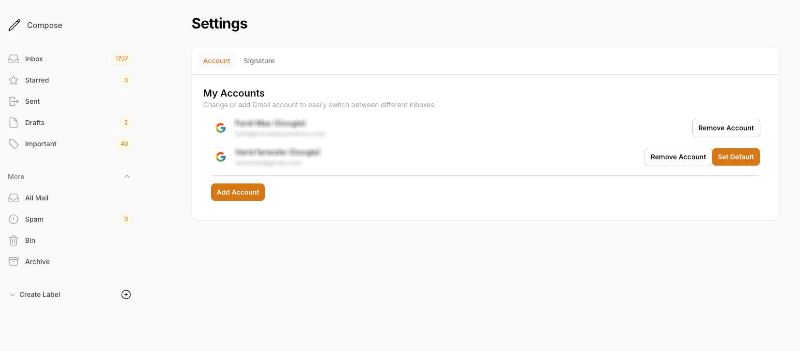
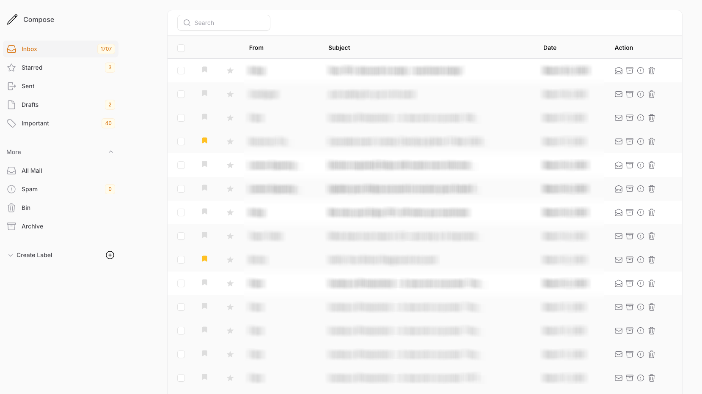
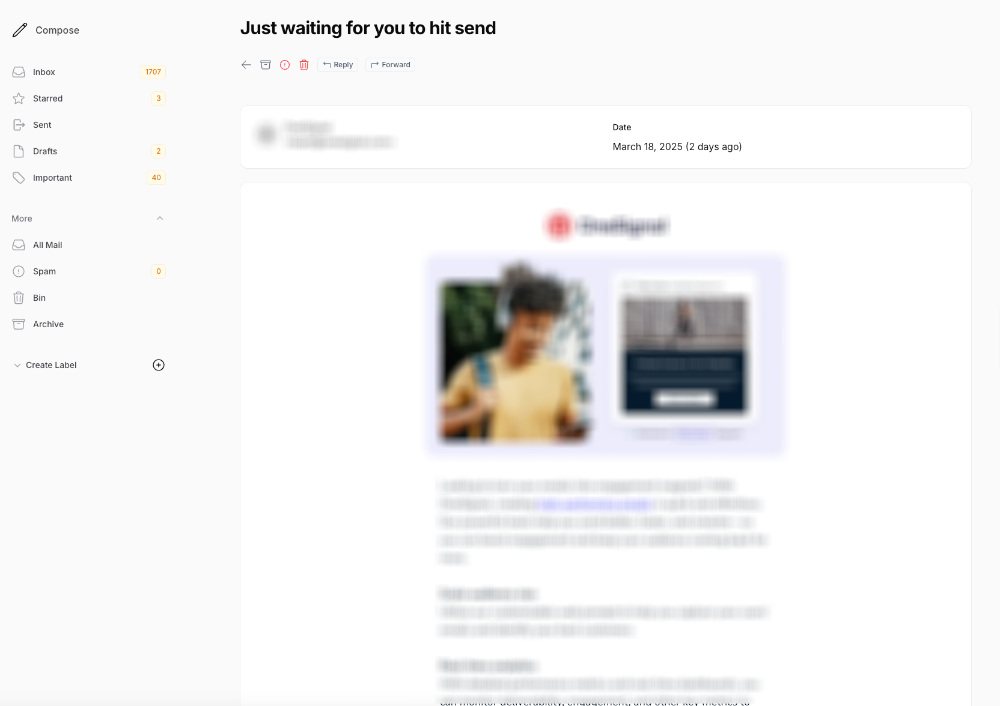
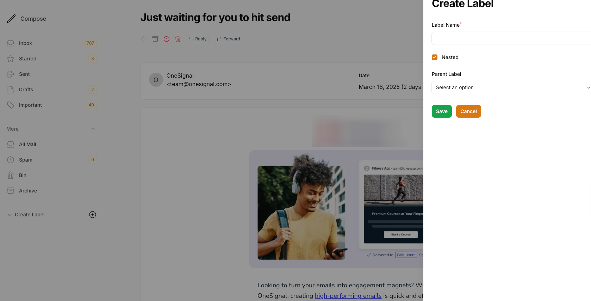
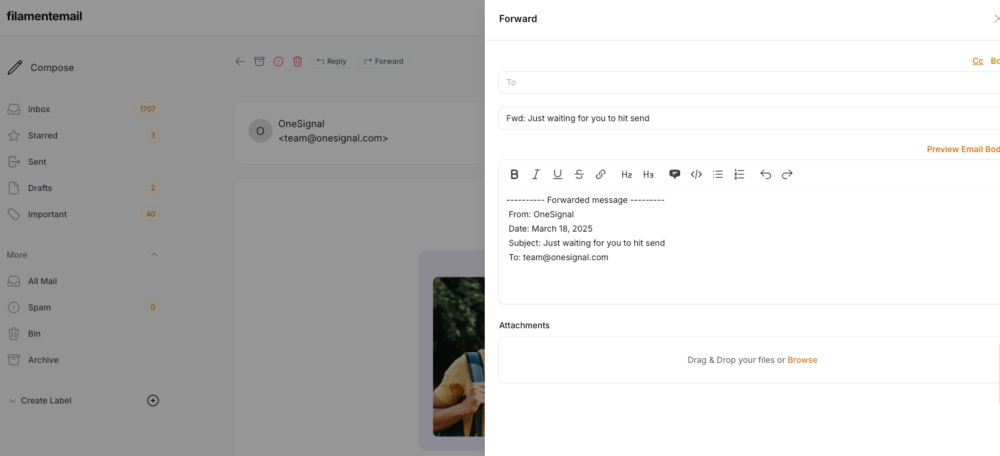
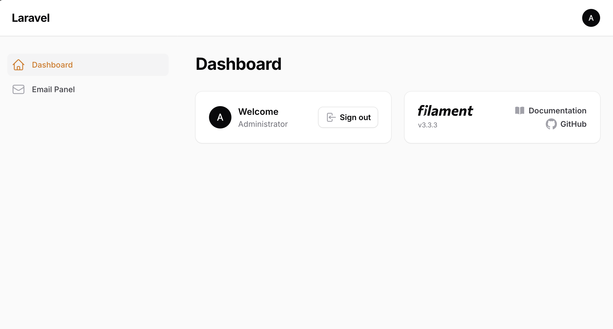

# ✉️ Email Pro

EmailPro is a powerful FilamentPHP plugin designed to seamlessly synchronize and manage emails within your application.

With EmailPro, you can effortlessly integrate Gmail, view and organize emails, and perform essential email actions—all within the FilamentPHP admin panel.

## 📑 Table of Contents
- [✉️ Email Pro](#️-email-pro)
  - [📑 Table of Contents](#-table-of-contents)
  - [Features](#features)
  - [Overview](#overview)
  - [Enable Gmail API in Google Cloud Console](#enable-gmail-api-in-google-cloud-console)
    - [Obtain API Credentials](#obtain-api-credentials)
  - [Configure Google API in Laravel](#configure-google-api-in-laravel)
  - [Installation](#installation)
    - [Requirements](#requirements)
    - [Activating Your License](#activating-your-license)
    - [Publishing Configuration and Migrations](#publishing-configuration-and-migrations)
  - [Usage](#usage)
    - [Updating User Model](#updating-user-model)
    - [Setting Up Queues](#setting-up-queues)
    - [Registering the Plugin](#registering-the-plugin)
  - [💬 Support](#-support)

## Features
- **Seamless Gmail Integration** – Effortlessly sync your Gmail account with your FilamentPHP application, ensuring real-time email management.
- **Centralized Email Management** – View, organize, and search emails directly within the FilamentPHP admin panel, streamlining workflow and reducing the need to switch between platforms.
- **Essential Email Actions** – Perform key actions such as reading, archiving, deleting, and labeling emails without leaving your application.
- **Enhanced Productivity** – Stay organized and manage communications efficiently with an intuitive and user-friendly email management experience inside FilamentPHP.

## Overview
This plugin integrates a **Gmail-like mailing feature** into Laravel Filament, allowing users to send, receive, and manage emails directly within a Filament panel. It uses the **Gmail API** for authentication and email management.







## Enable Gmail API in Google Cloud Console
To use this plugin, you need to enable the Gmail API in **Google Cloud Console** and set up OAuth credentials.

📌 Follow the official Google documentation to enable Gmail API and create OAuth credentials:
[Enable Gmail API](https://developers.google.com/gmail/api/quickstart/php)

### Obtain API Credentials
After following the steps above, you should have:
- **Client ID**
- **Client Secret**
- **Redirect URI**

## Configure Google API in Laravel
1. Configure your Google OAuth credentials in `.env`:

```ini
GOOGLE_CLIENT_ID=YOUR_GOOGLE_CLIENT_ID
GOOGLE_CLIENT_SECRET=YOUR_GOOGLE_CLIENT_SECRET
GOOGLE_REDIRECT_URI="https://your_domain.com/mail/oauth/callback/google"
```

2. Add Google credentials in `config/services.php`:

```php
'google' => [
    'client_id' => env('GOOGLE_CLIENT_ID'),
    'client_secret' => env('GOOGLE_CLIENT_SECRET'),
    'redirect' => env('GOOGLE_REDIRECT_URI'),
],
```

## Installation

### Requirements
- Laravel Filament v3
- Laravel 11+
- PHP 8.2+
- A **Google Cloud Project** with Gmail API enabled

### Activating Your License
Email Pro leverages AnyStack for seamless payment processing, licensing, and distribution.

Add the following repository to your `composer.json` file:

```json
"repositories": [
    {
        "type": "composer",
        "url": "https://email-pro.composer.sh"
    }
],
```

Then install the package:

```bash
composer require cvcwebsolutions/email-pro
```

You will be prompted to provide your username and password:

```bash
Username: [licensee-email]
Password: [license-key]
```

### Publishing Configuration and Migrations
Publish the config file:

```bash
php artisan vendor:publish --tag="email-pro-config"
```

Publish and run migrations:

```bash
php artisan vendor:publish --tag="email-pro-migrations"
php artisan migrate
```

Optionally, publish the views:

```bash
php artisan vendor:publish --tag="email-pro-views"
```

## Usage

### Updating User Model
Add the `HasEmailProviders` trait to the User model:

```php
use Cvcwebsolutions\EmailPro\Traits\HasEmailProviders;
use Illuminate\Database\Eloquent\Model;

YourUserModel extends Model {
    use HasEmailProviders;
}
```

### Setting Up Queues
Since email operations involve API requests, it's recommended to use a queue system:

```ini
QUEUE_CONNECTION=database
```

or

```ini
QUEUE_CONNECTION=redis
```

Start the queue worker:

```bash
php artisan queue:work
```

### Registering the Plugin
To use this package, register the plugin in your Filament Panel Provider class:

```php
use Cvcwebsolutions\EmailPro\EmailProPlugin;

// ...
->plugins([
    EmailProPlugin::make()
]);
```

It will generate a navigation menu item based on `config('email-pro.filament.menu_item')`:



Clicking the menu will lead to the settings page:


## 💬 Support
You can reach us via email:
- 📧 [Email support](mailto:developer@cvcwebsolutions.com)
